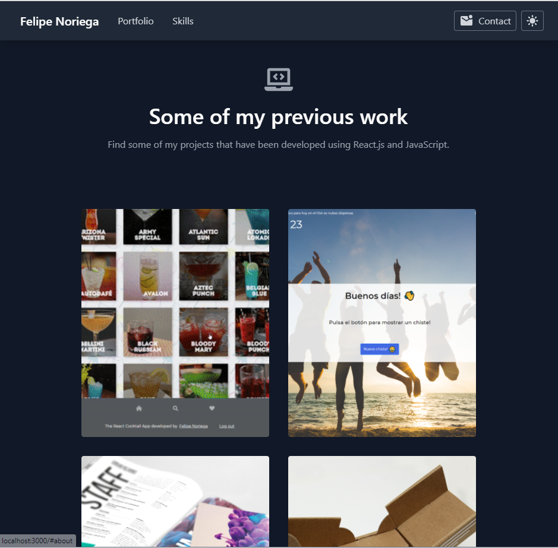

### REACT PORTFOLIO

### About

This project was bootstrapped with [Create React App](https://github.com/facebook/create-react-app).

Portofolio website built using React and [Tailwindcss](https://tailwindcss.com/).

It uses [Netlify](https://www.netlify.com/) for deployment and form submissions.

Project consits of a responsive page which includes past work and a contact form and a light/dark theme mode switch.

[Live Demo](https://felipe-nl-portfolio.netlify.app/).
